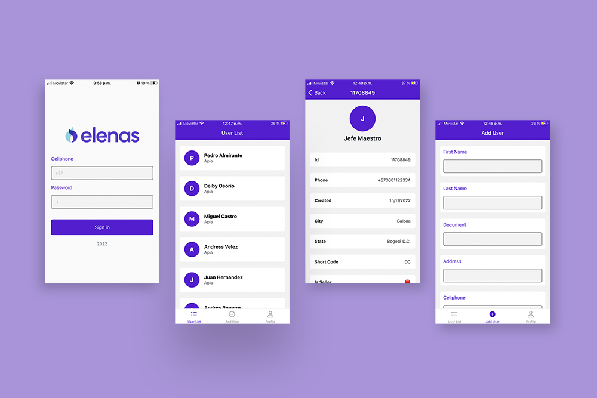

# 🖖 Prueba técnica frontend - Elenas
 


This is a [React Native App](https://reactnative.dev/) project bootstrapped with [`npx create-expo-app AwesomeProject`](https://reactnative.dev/docs/environment-setup).

Prueba técnica para [Elenas](https://www.elenas.co/), basada en la creación de una aplicación móvil para la gestión (consultar, crear y actualizar) de clientes.

## Instalación

Este proyecto ha sido desarrollado en React Native, por lo que primero deberás instalar las dependencias correspondientes.

```
git clone https://github.com/donCelis/app-elenas.git
cd app-elenas
npm i -E
```

## Uso

### -Inicio del servidor

```bash
npm run start (Recomendado)
npm run ios
npm run android
```

PD: En caso de no tener los emuladores instalados, usar la app [Expo go](https://expo.dev/client)

Si necesitas saber los demás comandos de npm puedes consultar el archivo: `package.json`


## Observaciones del proyecto

1. Este proyecto se sirve de una graphql api suministrada por la empresa.
2. Se recomienda probar la app en ios con el emulador de expo
3. Todos los recursos usados en este proyecto son con fines sin ánimo de lucro.
4. La imagen corporativa de elenas ha sido usada solo con fines demostrativos.


## License

This project is open source and available under the [MIT License](LICENSE).
___
 
Copyright © 2020 - present [Alexander Celis](https://github.com/donCelis) 🇨🇴 